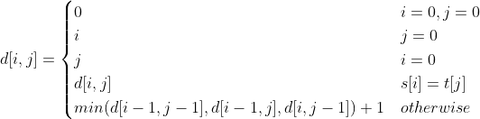

# Условие

Задача на программирование. Языки С, С++ или Java. Составить программу решения задачи.
Сережа – начинающий бизнесмен, изучив последние тенденции в мире, он решил, что фрилансу
решительно не хватает ещё одной системы по поиску похожих программ. Так как Сережа –
математик и не очень хорошо программирует, он нанял вас, чтобы вы реализовали данную систему.
И хотя Сережа не программист, он отлично знает, как должна работать система поиска. Программа
фрилансера будет по очереди сравниваться со всеми программами из интернета и для каждой
программы из интернета будет выдаваться её сходство с данной программой. Сходством будет
являться минимальное количество операций вставки знака на произвольную позицию, удаления
любого знака, либо замены любого знака на другой, применённых к общедоступному тексту,
необходимых для получения программы фрилансера. Для начала в качестве минимального
прототипа от вас требуется реализовать функцию нахождения сходства двух программ.

# Решение 

Более формальная постановка такой задачи - подсчет расстояния Левенштейна для двух строк. Данная задача решается методом динамического программирования. С учетом того, что стоимость всех операций одинаковая и нумерация строк начинается с 1, имеем следующие соотношения:

